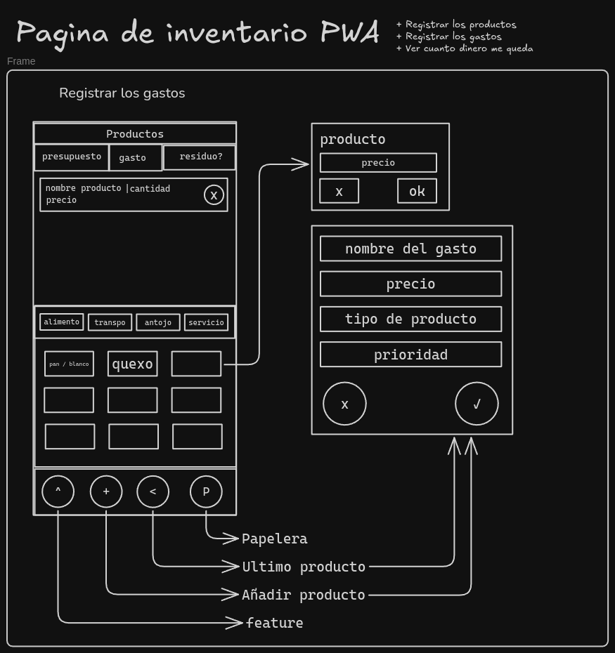

# ControlMoon: App Web para Control de Gastos Mensuales

## Descripción
ControlMoon es una aplicación web diseñada para ayudarte a gestionar tus gastos mensuales de manera sencilla y eficiente.

## Requerimientos Principales

- **Registro sencillo de productos comprados**
- **Visualización de gastos semanales y sus categorías**
- **Registro de gastos diarios y cálculo del saldo restante semanal/mensual**
- **Generación de planes de ahorro personalizados**

## Funcionalidades Clave

1. **Registrar productos:** Añade fácilmente los productos que compras.
2. **Registrar gastos:** Ingresa tus gastos diarios de forma rápida.
3. **Ver saldo disponible:** Consulta cuánto dinero te queda en la semana o mes.

## Primeros Pasos

- **Diseñar las interfaces:** Comienza por definir cómo se verá y funcionará la app.

## Interfaz de Registro de Gastos

- Permite registrar un gasto de manera fácil y rápida.
- Muestra una lista de productos comprados recientemente.

## Elementos Incluidos en la Feature

- Visualización de gastos semanales y sus categorías.
- Registro de gastos diarios y cálculo del saldo restante.
- Generación de planes de ahorro.

## Tecnología Utilizada

- **React:** Para el desarrollo de la interfaz de usuario.

---

